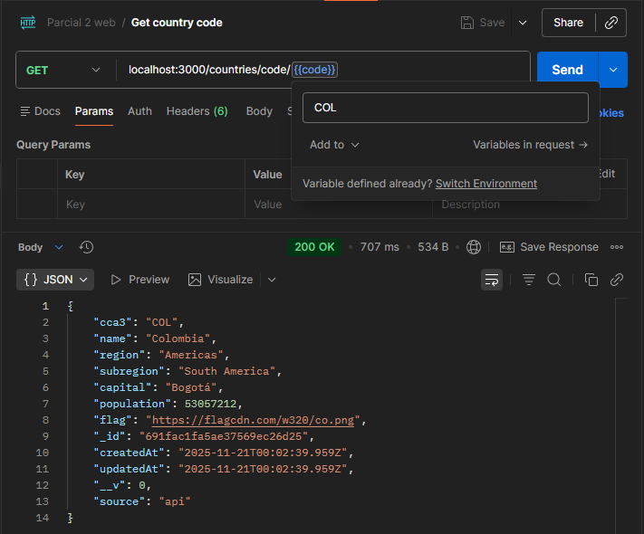
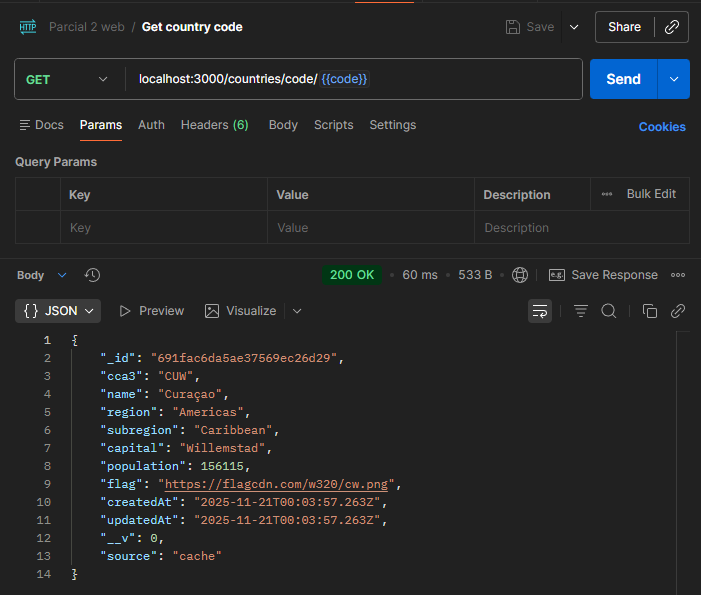
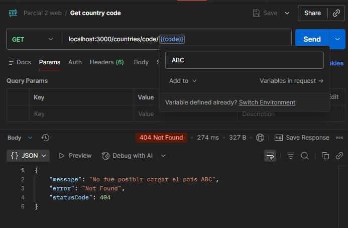
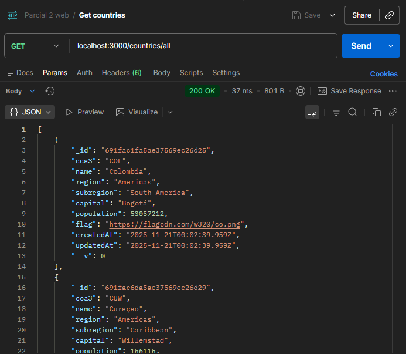
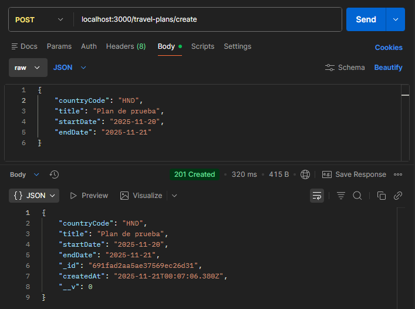
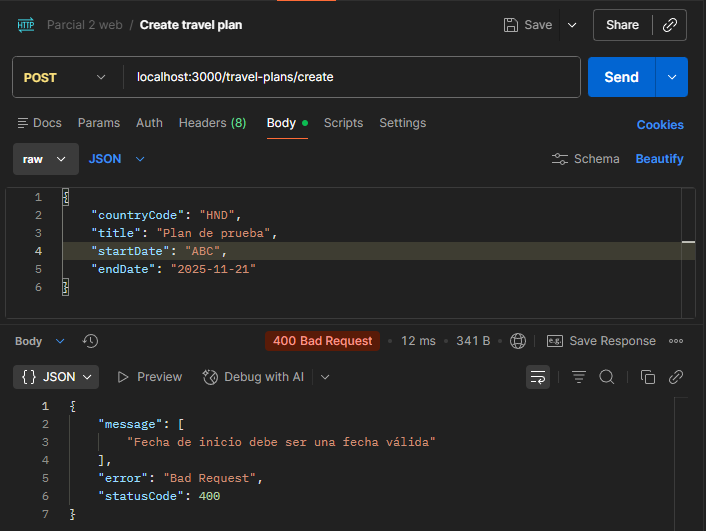
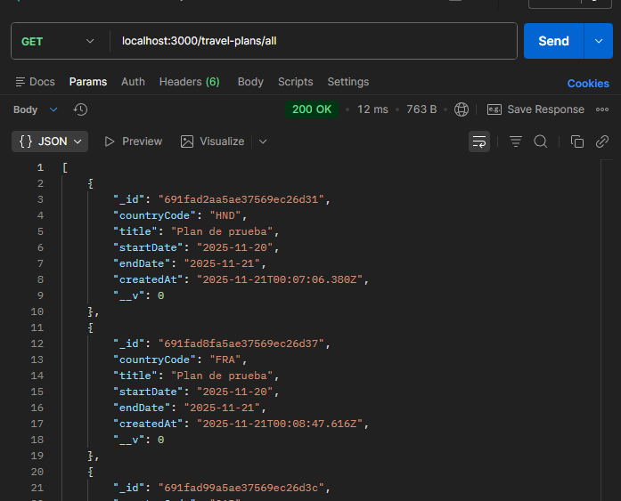
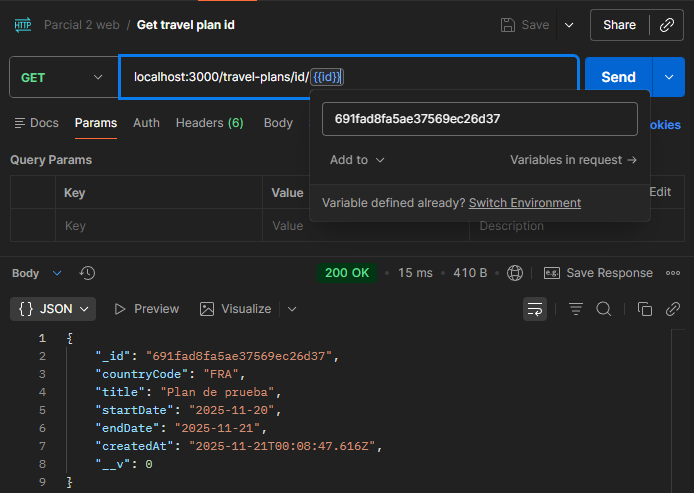

# Parcial 2 - Programación con tecnologías web
## Description

Este repositorio contiene el código fuente de la solución al parcial 2 de la materia con todos los requisitos propuestos en la guía.
## Configuración del proyecto
Para instalar dependencias y preparar el entorno de NestJS se debe ejecutar el siguiente comando en una terminal desde la raíz del proyecto
```bash
$ npm install
```
Este proyecto utiliza como tecnología de base de datos **MongoDB** con alojamiento local, por lo que para la ejecución correcta del proyecto se debe tener una conexión local abierta de **MongoDB** con una base de datos llamada **P2** donde se almacenarán las colecciones `countries` y `travel-plans`. Esta conexión local debe correr en:
```
http://localhost:27017/P2/
```
## Compilar y correr
Una vez que esté corriendo adecuadamente la base de datos se puede ejecutar el proyecto con el comando
```bash
# development
$ npm run start
```
Una vez ejecutado se pueden realizar las peticiones usando Postman o cualquier manejador de peticiones HTTP a:
```
http://localhost:3000
```
## Estructura del proyecto
Este proyecto de NestJS tiene dos módulos organizados de la siguiente manera:

    src/
    ├── app.controller.ts
    ├── app.module.ts
    ├── app.service.ts
    ├── main.ts
    ├── countries/
    │   ├── countries.controller.ts
    |   ├── countries.module.ts
    |   ├── countries.service.ts
    |   ├── providers/
    |   |   ├── country.interface.ts
    |   |   └── rest-countries.provider.ts
    |   └── schemas/
    |       └── country.schema.ts
    └── travel-plans/
        ├── travel-plans.controller.ts
        ├── travel-plans.module.ts
        ├── travel-plans.service.ts
        ├── dto/
        |   └── travel-plans.dto.ts
        └── schemas/
            └── travel-plan.schema.ts

Acá podemos observar los dos módulos que componen al proyecto, en cada uno de ellos tenemos el archivo `.module` que se encarga de manejar las inyecciones de dependencias del módulo, el archivo `.controller` que se encarga de exponer los endpoints y el archivo `.server` que contiene la lógica de cada módulo. Adicionalmente tenemos el archivo `.schema` que define la estructura de los documentos que se guardan en la base de datos.

En el módulo `countries` tenemos una carpeta `providers` en donde se define la interfaz de los países, la estructura de los datos que tiene cada país y un provider que se encarga únicamente de realizar peticiones a la API de https://restcountries.com/v3.1/alpha solicitando la información de un país en específico.

En el módulo `travel-plans` tenemos un archivo `.dto` que utiliza el controlador para que cada vez que recibe una petición de tipo POST validar los datos usando el DTO antes de que pase por el servicio del módulo.

## Endpoints

El módulo `countries` expone los endpoints:

* `/all`: que muestra la información de todos los países que están guardados en la base de datos de caché
* `/code/<CODE>`: que muestra la información del país cuyo código alpha-3 corresponde a `<CODE>`.

El módulo `travel-plans` expone los endpoints:

* `/all`: que muestra todos los planes de viaje registrados
* `/id/<ID>`: que muestra la información del plan de viaje con el id correspondiente a `<ID>`
* `/create`: que acepta peticiones de tipo POST en dónde en el body se encuentra la información del plan de viaje a crear. Un ejemplo sería
``` json
// Request Body
{
  "countryCode": "COL",
  "title": "Example travel plan",
  "startDate": "2025-11-20",
  "endDate": "2026-01-01"
}
```

## Provider Externo

El provider externo que se encuentra en el módulo `countries` utiliza axios para manejar las peticiones, en el método `getCountryByCode()` define la url a la que le hará la petición y ejecuta el método get, a partir de esto revisa que haya obtenido una respuesta y la transforma al formato de campos definido para los países. Si hubo un error se arroja la excepción.

## Modelo de datos

Los documentos que se guardan en la base de datos son de colección `countries` o de colección `travel-plans`, estos primeros tienen los campos:

* `cca3`: string
* ``name``: string
* ``region``: string
* ``subregion``: string
* ``capital``: string
* ``population``: number
* ``flag``: string
* ``source``: string (Opcional, este campo se llena cuando el controlador sabe si la información fue obtenida de caché o de API)

La colección `travel-plans` tiene los siguientes campos:
* ``countryCode``: string
* ``title``: string
* ``startDate``: string
* ``endDate``: string
* ``notes``: string (Opcional)

## Pruebas de ejecución

### Consultar país no cacheado


### Consultar país cacheado


### Consultar país no válido


### Consultar todos los paises cacheados


### Crear nuevo plan de viaje


### Plan de viaje con campos inválidos


### Listar planes de viaje


### Obtener un plan de viaje
